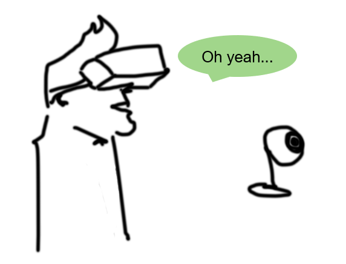
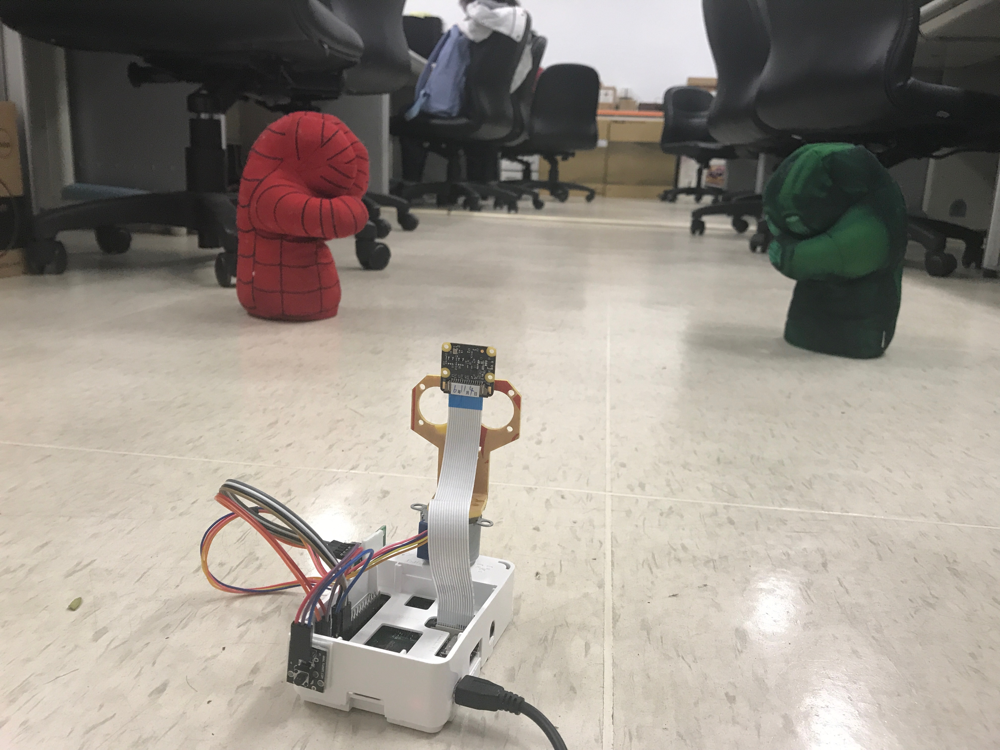
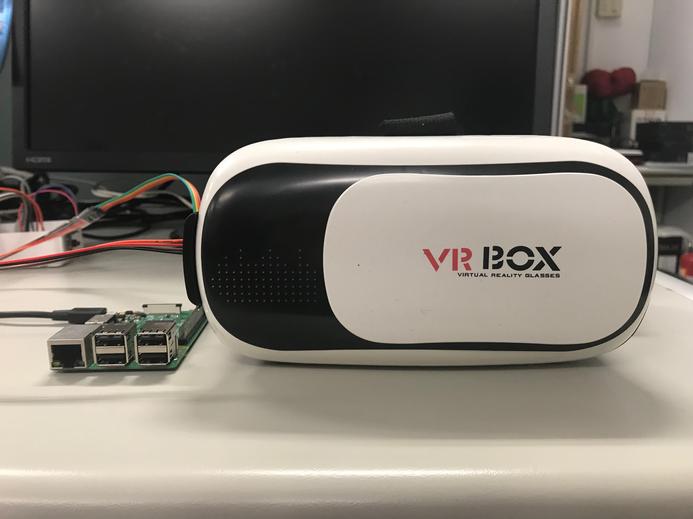

# 2018 Fall Embedded System Final Project


## Motivatoin

  Live broadcast is getting more and more popular nowadays, and it became an important part in social media.
  But there's a big problem -- the field of view is highly restricted, the user can only see the part where the broadcaster shows them.
  So we want to craete a new experience in live broadcast, enabling users can interact more with each other.
  
## Introduction

  With the growing popularity of VR (Virtual Reality), we decide to borrow the idea of it, and integrate in the live broadcast. We want to enable user to change their point of view actively while live broadcast, see whereever they want, enjoy more fun with friends.
  We want to make a product as illustration below: the little camera can record videos, and rotates according to the movement of the user's head, and he/she can watch the live video in the HMD (head-mounted display)



## Materials

* Raspberry Pi *2
* Pi camera
* Stepper motor
* Head mounted display
* Smartphone
* Internet

## Server site


### target 
  Server records the video, and streams to localhost, therefore others can watch the live broadcast on the browser. Additionally, the camera can rotate according to the user's head movements which might be far away.
  
### Streaming the video
  We use a tool named **mjpeg-streamer** to help us stream on the Raspberry Pi. It can be used to stream JPEG files over IP-based network from a webcam to various browsers. Furthermore, It's written for embedded devices with limited resources  in terms RAM and CPU.

The complete source code can be found on github : [mjpg-streamer](https://github.com/jacksonliam/mjpg-streamer)
One can set up the server by following steps:

1. Preparation
   Fist, check that Raspberry Pi is conneted to Wi-Fi, and record the IP address of two Raspberry Pi.
   To find the IP, simply type command below:
   ``` bash
   $ ifconfig
   ```
   After that, connect the Pi camera to the Raspberry Pi, and type:
   ```bash
   $ sudo raspi-config
   ```
   then enable the camera. 
  
2. Set up the mjpg-streamer
   clone the repo from the website:
   ```
   $ git clone https://github.com/jacksonliam/mjpg-streamer.git
   ```
   
   Next, we have to compile the source codes:
   ```bash
   $ cd mjpg-streamer/
   $ cd mjpg-streamer-experimental/
   $ sudo apt-get install cmake
   $ sudo apt-get install python-imaging
   $ sudo apt-get install libjpeg-dev
   $ make CMAKE_BUILD_TYPE=Debug
   $ sudo make install
   ```
   
   We need to set an environment variable:
   ```bash
   $ export LD_LIBRARY_PATH=.
   ```
   
   Now we can start streaming:
   ```bash
   $ ./mjpg_streamer -o "output_http.so -w ./www" -i "input_raspicam.so"
   ```
   
   We can see the video by go to the link in the browser:
   ```
   http://HOSTNAME:8080/?action=stream
   ```
   where the HOSTNAME is the IP address of the server Raspberry Pi
   
## Client site


